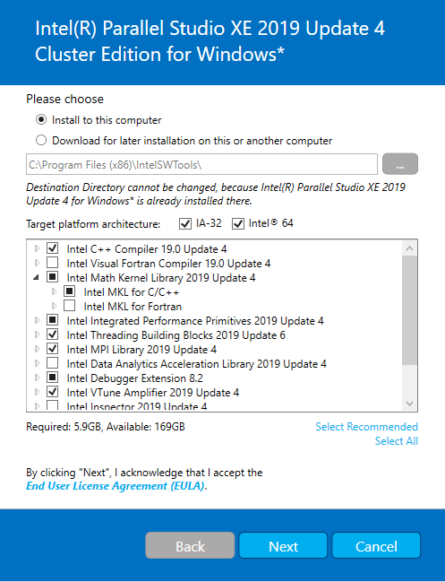

# RDS
## Environment setup instructions:
- For all applications:
  - Install [Git](https://git-scm.com/).
  - Install [CMake](https://cmake.org/).
  - Install [Visual Studio](https://visualstudio.microsoft.com/downloads/).
  - Install [Intel Parallel Studio XE](https://software.intel.com/en-us/parallel-studio-xe). To get a serial number for free, you will have to create a user with your institution email.
  
  

- Additional prerequisites for electron applications:
  - Install [NodeJS](https://nodejs.org).
  - Install [Visual Studio Code](https://code.visualstudio.com/).
  - Open command prompt, and navigate to the project's root folder. Run the following commands:
      1. `npm install -g cmake-js`
      2. `npm install -g polymer-cli`
      3. `npm install -g @pika/cli`
      3. `npm install`

## Build instructions:
 1. Open command prompt, and navigate to a folder named `boost` inside the repository's root folder. Run the following commands:
    - ./bootstrap.sh
    - ./b2 headers
 2. Open command prompt, and navigate to the repository's root folder. Run the following command `cmake-js configure`.
